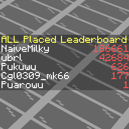

Stats Scoreboard
===
It's a simple mod which displays all players' statistical data on the sidebar in <strong>both Singleplayer and Server</strong>!

<strong>1000+ Criteria!</strong> Each criterion uniquely corresponds to a sidebar-scoreboard displaying the corresponding statistical data of players.

Players can choose their preferred criteria and <strong>display them alternately</strong> on their sidebar.

Other languages: 
- [简体中文](README_zh-cn.md)

Dependencies
---
- Minecraft 1.21 ~ 1.21.11 / 26.1 ~ 26.1.2
- [Fabric Loader 0.17.0+](https://github.com/FabricMC/fabric-loader)
- [Fabric API](https://github.com/FabricMC/fabric-api)

Criteria
---
#### Block Related
- `block.mined.all` - Count of mining blocks.
- `block.mined.<namespace>.<block>` - Count of mining the given block.
- `block.placed.all` - Placed count of blocks.
- `block.placed.<namespace>.<block>` - Placed count of the given block.
#### Custom
- `custom.<namespace>.<stat>` - A custom statistical data.
#### Entity Related
- `entity.killed.all` - Count of killing entities.
- `entity.killed.<namespace>.<entity>` - Count of killing the given entity.
- `entity.killed_by.all` - Count of killing by entities.
- `entity.killed_by.<namespace>.<entity>` - Count of killing by the given entity.
#### Item Related
- `item.broken.all` - Count of breaking items.
- `item.broken.<namespace>.<item>` - Count of breaking the given item.
- `item.crafted.all` - Count of crafting items.
- `item.crafted.<namespace>.<item>` - Count of crafting the given item.
- `item.dropped.all` - Count of dropping items.
- `item.dropped.<namespace>.<item>` - Count of dropping the given item.
- `item.picked_up.all` - Count of picking items up.
- `item.picked_up.<namespace>.<item>` - Count of picking the given item up.
- `item.used.all` - Count of using items.
- `item.used.<namespace>.<item>` - Count of using the given item.

Commands
---
#### Common
- `/statsscoreboard` and `/ssb` - Main Command, shows info.
- `/statsscoreboard about` - Shows info.
- `/statsscoreboard sidebar` - Displays the criteria you have chosen.
  - `/statsscoreboard sidebar add <criterion>` - Chooses a new criterion.
  - `/statsscoreboard sidebar remove <criterion>` - Removes a chosen criterion.
- `/statsscoreboard sidebarRotationInterval` - Displays the time interval for rotating your sidebar.
  - `/statsscoreboard sidebarRotationInterval <interval>` - Sets the interval.
#### OP Only
- `/statsscoreboard configAutoSaveInterval` - Displays the time interval for auto-saving of configs.
    - `/statsscoreboard configAutoSaveInterval <interval>` - Sets the interval.
- `/statsscoreboard defaultSidebar` - Displays default chosen criterion for new players.
    -  `/statsscoreboard defaultSidebar <criterion>` - Sets the criterion.
- `/statsscoreboard refreshAllStatsDataInterval` - Displays the time interval for full reloading of statistical data.
    - `/statsscoreboard refreshAllStatsDataInterval <interval>` - Sets the interval.
- `/statsscoreboard sidebarDisplayUUID` - Displays whether displays players' UUID on the sidebar. This usually occurs to players who have already joined the server before installing the mod, until they join the server again.
    - `/statsscoreboard sidebarDisplayUUID <enable>` - Enables / Disables the setting.

FAQ
---
<strong>Q1. Will the sidebar display the existing statistical data before installing the mod?</strong>

A1. Of course. The mod reads stats-files to load data.

<strong>Q2. Why do some players display UUID instead of their names?</strong>

A2. The most probable scenario is that they joined the server before installing the mod and have not logged in since then. The mod will automatically synchronize the player's name when they log in.

<strong>Q3. Is the sidebar displayed independently for each player?</strong>

A3. It is. The sidebar data for different players is completely isolated.

<strong>Q4. Can multiple criteria be displayed on the sidebar?</strong>

A4. Yes. They will be displayed on the sidebar in turn.

<strong>Q5. Can the sidebar be hidden?</strong>

A5. Sure. Just remove all criteria you have chosen.

Issues & Feedbacks
---
If you encounter any bugs or have suggestions for new features, please feel free to submit them via [GitHub Issues](https://github.com/NekoMilky/stats-scoreboard/issues).

Build
---
```bash
git clone https://github.com/NekoMilky/stats-scoreboard.git
cd stats-scoreboard
./gradlew build
```
The product will be found in the directory `stats-scoreboard/versions/{version}/build/lib/`.

License
---
This project uses [MIT License](LICENSE).

Thanks
---
This project utilizes the following open-source projects:
- [@Patbox/SidebarAPI - Simple API for Fabric server side sidebars](https://github.com/Patbox/SidebarAPI) - LGPL 3.0 License
- [@NucleoidMC/Server-Translations - A library for handling translations server side](https://github.com/NucleoidMC/Server-Translations) - MIT License
- [@FabricMC/fabric-api - Essential hooks for modding with Fabric](https://github.com/FabricMC/fabric-api) - Apache 2.0 License
- [@FabricMC/fabric-loader - Fabric's mostly-version-independent mod loader](https://github.com/FabricMC/fabric-loader) - Apache 2.0 License
- [@FabricMC/fabric-loom - Gradle build system plugin used to automate the setup of a minecraft mod development environment](https://github.com/FabricMC/fabric-loom) - MIT License
- [@FabricMC/yarn - Libre Minecraft mappings, free to use for everyone. No exceptions](https://github.com/fabricMC/yarn) - CC0 1.0 License
- [@google/gson - A Java serialization/deserialization library to convert Java Objects into JSON and back](https://github.com/google/gson) - Apache 2.0 License
- [@qos-ch/slf4j - Simple Logging Facade for Java](https://github.com/qos-ch/slf4j) - MIT License
